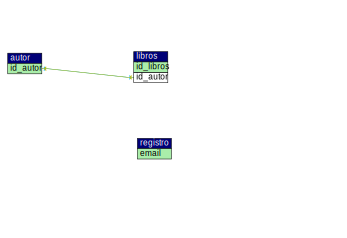

# TPEweb2

TPE - Parte 1

Integrantes: Ledesma Ingrid - Andino Geronimo.

TEMATICA  TPE:
Se propone desarrollar un sitio web dinámico sobre autores y sus libros. El mismo  estará disponible para cualquier persona, pero solo el/los usuario/s administrador/es tendrá los permisos necesarios para gestionar todos los ítems del sitio, incluyendo la creación, modificación y eliminación de los mismos.

INSTRUCCIONES PARA EJECUTAR EL PROYECTO:
1. Clonar el repositorio al local.
2. Iniciar Xampp y Sql (localmente).
3. Abrir VSC para visualizar el proyecto.

Diagrama (DER):

